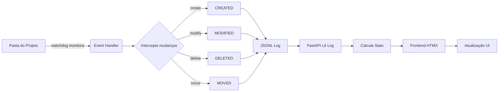

# 🚀 Hermes Activity Dashboard

Monitoramento em tempo real de modificações em projetos de código. Veja exatamente o que está mudando, quantas linhas são adicionadas/removidas, e acompanhe a evolução do seu código enquanto trabalha.

  

---

## ✨ Características

- **🔄 Real-time** — Acompanhe mudanças instantaneamente via WebSocket
- **📊 Estatísticas vivas** — Linhas adicionadas/removidas, arquivos modificados, duração
- **📁 Multi-projeto** — Abra qualquer pasta do seu sistema
- **🔍 Diff viewer** — Veja exatamente o que mudou em cada arquivo
- **🎨 Design moderno** — Dark mode, glassmorphism, gradientes suaves, tipografia de alta qualidade
- **🖥️ Desktop-first** — Otimizado para desenvolvedores (masresponsivo)
- **⚡ Zero interferência** — Roda separado, não afeta o Hermes nem suas ferramentas

---

## 📸 Screenshots

*(O dashboard tem um visual moderno com cards em gradiente, timeline animada e badges coloridas por tipo de evento)*

---

## 🛠️ Instalação

### Pré-requisitos
- Python 3.10+
- pip

### Passo a passo

```bash
# 1. Clone ou baixe o projeto
cd ~/hermes-activity-dashboard

# 2. Instale dependências
pip install -r requirements.txt

# 3. Execute
python dashboard.py --project /caminho/do/seu/projeto
```

Ou, para especificar porta/host:
```bash
python dashboard.py --project ~/projetos/app --port 8080 --host 0.0.0.0
```

---

## 🎯 Como Usar

### 1. Inicie o dashboard
```bash
python dashboard.py --project /home/leonardo/meu-projeto
```

### 2. Abra no navegador
```
http://localhost:8000
```

### 3. Selecione o projeto (se não especificou na CLI)
- Clique em **"Abrir Projeto"** no canto superior direito
- Digite o caminho absoluto da pasta
- Clique em OK

### 4. Acompanhe!
- A timeline atualiza automaticamente a cada 2 segundos
- Clique em **"VER DIFF"** em qualquer evento para ver o conteúdo completo
- Use os filtros (MODIFIED, CREATED, DELETED) para focar em tipos específicos

---

## 🔧 Comandos Úteis

### Iniciar com projeto padrão
```bash
python dashboard.py --project ~/hermes
```

### Apenas servidor (sem projeto ainda)
```bash
python dashboard.py
# Depois selecione no browser
```

### Mudar projeto a qualquer momento
Clique em **"Abrir Projeto"** no topo e selecione nova pasta.

### Parar o servidor
`Ctrl+C` no terminal onde ele está rodando.

---

## 📡 API Endpoints (para integração)

| Endpoint | Método | Descrição |
|----------|--------|-----------|
| `/` | GET | Dashboard (HTML) |
| `/api/status` | GET | Status atual (projeto, observer) |
| `/api/activities` | GET | Lista de eventos recentes |
| `/api/stats` | GET | Estatísticas agregadas |
| `/api/event/{id}` | GET | Detalhes de evento específico (com diff) |
| `/api/set-project` | POST | Define pasta do projeto |
| `/api/reset` | POST | Limpa log atual |
| `/ws` | WS | WebSocket para eventos em tempo real |

---

## 🤔 Como Funciona?



1. **Observer** — Usa `watchdog` para detectar mudanças na pasta (criação, modificação, exclusão, movimentação)
2. **Buffer** — Eventos são mantidos em memória (circular buffer de 5000 eventos)
3. **API** — FastAPI serve JSON + HTML
4. **Frontend** — HTMX atualiza a página automaticamente sem JS pesado
5. **WebSocket** — Push instantâneo de novos eventos (se disponível)

---

## 🎨 Personalização

### Cores (CSS Variables)
Edite no `frontend/index.html`:
```css
:root {
    --accent-primary: #3b82f6;  /* Azul */
    --accent-secondary: #10b981; /* Verde */
    --accent-tertiary: #8b5cf6;  /* Roxo */
}
```

### Polling Interval
Altere o atributo `hx-trigger="every 2s"` no HTML para outro intervalo.

### Tamanho do Buffer
Edite `_MAX_BUFFER = 5000` no `dashboard.py`.

---

## 🐛 Troubleshooting

### Porta já em uso
```bash
lsof -i :8000       # Descobre quem tá usando
kill -9 <PID>       # Mata o processo
```

### Watchdog não instalado
```bash
pip install watchdog
```

### Observação não inicia
```
Verifique:
1. A pasta existe e é válida
2. Você tem permissão de leitura
3. watchdog está instalado
```

---

## 📦 Estrutura do Projeto

```
hermes-activity-dashboard/
├── dashboard.py         # Servidor FastAPI + observer
├── frontend/
│   └── index.html       # Interface completa (estáticos)
├── requirements.txt     # Dependências Python
├── README.md           # Este arquivo
└── activity.log        # (gerado) Log de eventos
```

---

## 🚀 roadmap

- [ ] Gráfico de atividade por hora (Grátis)
- [ ] Exportação CSV/JSON
- [ ] Notificações desktop
- [ ] Modo fullscreen
- [ ] Suporte a múltiplos projetos simultâneos
- [ ] Integração com Git (commits associados)

---

## 📄 Licença

MIT — Use a vontade. O dashboard é independente, não tem relação oficial com o Hermes Agent.

---

**Feito com ☕ e 💻 por quem entende de ferramentas de desenvolvedor.**
